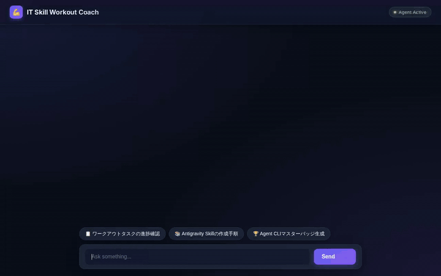

# 💪 IT Skill Workout Coach

An interactive AI coach that guides software engineers and IT practitioners in mastering **Google Antigravity**, **Agent CLI**, and **M365 Copilot**. Powered by Google ADK, Vertex AI Memory Bank, Agent Platform, and A2UI rich interface cards.

---

## 🎬 Live Demo & Interactive UI



*The looping demo above demonstrates (1) querying workout tasks via Firestore database lookup rendered as an **A2UI Card**, and (2) generating achievement badge artwork via `gemini-3.1-flash-lite-image` uploaded to Cloud Storage.*

---

## ✨ Key Features

- 📋 **Structured IT Workout Task Management**: Create, list, and update learning tasks across Antigravity, Agent CLI, and M365 Copilot using Firestore.
- 🎨 **AI Achievement Badge Generation**: Generate custom 3D glowing achievement emblems with `gemini-3.1-flash-lite-image`, save them to Playground Artifacts, and publish them to a public Cloud Storage bucket.
- 🎥 **Omni Video Teaser Generation**: Create high-energy 3D motion teaser videos using Google's Omni model (`gemini-omni-flash-preview`) in the `global` region.
- 📚 **RAG Corpus Retrieval**: Query the Gutenberg library corpus and Google Antigravity skill guidelines using Vertex AI RAG Engine.
- 🧠 **Cross-Session Long-Term Memory**: Remember user preferences, skill mastery levels, and past achievements across chat sessions using Vertex AI Memory Bank.
- 🃏 **A2UI Rich Component Cards**: Native rendering of flat, modern UI cards (Cards, Columns, Rows, Badges, and Images) inside both ADK Web and the custom production web frontend.
- 🚀 **Cloud Run Production Deployment**: Serves a FastAPI proxy talking A2A protocol connected to the deployed Agent Engine runtime.

---

## ☁️ Google Cloud & Vertex AI Architecture

| Google Cloud Tool / Service | Implementation & Role |
| :--- | :--- |
| **Vertex AI Memory Bank** | Manages persistent cross-session long-term memory (`MEMORY_BANK_ID`) for user learning profiles. |
| **Cloud Firestore** | Stores IT workout tasks, completion statuses, and difficulty levels in project `qwiklabs-gcp-03-4f265f3b8af7`. |
| **Cloud Storage (GCS)** | Public asset bucket (`antigravity-it-workout-coach-assets-4f265f3b`) hosting generated achievement badges and video teasers. |
| **Vertex AI RAG Engine** | Serverless retrieval corpus for grounding answers on documentation and text archives. |
| **Gemini Image Generation** | Uses `gemini-3.1-flash-lite-image` for generating 3D achievement badge artwork. |
| **Google Omni Model** | Uses `gemini-omni-flash-preview` in `global` region for AI video generation. |
| **A2UI (Agent-to-User UI)** | Version `0.8` schema manager + Basic Catalog for structured card responses. |
| **Agent Platform / Agent Engine** | Managed Reasoning Engine deployment (`us-east1`) running Google ADK framework. |
| **Cloud Run** | Serverless container host for the FastAPI proxy and glassmorphic dialogue UI. |

---

## 📁 Repository Structure

```
antigravity-it-skill-workout-coach/
├── app/                        # Agent Engine core package
│   ├── agent.py                # Main agent definition, tools, & A2UI prompt
│   └── a2ui_utils.py           # A2UI after_model_callback renderer
├── frontend/                   # Web frontend & FastAPI proxy
│   ├── main.py                 # FastAPI proxy server (A2A protocol client)
│   ├── requirements.txt        # Frontend dependencies
│   └── static/
│       └── index.html          # Modern glassmorphic dialogue chat UI
├── demo.gif                    # Loop demo animation
├── agents-cli-manifest.yaml    # Agents CLI deployment configuration
├── pyproject.toml              # Project dependencies & build config
└── README.md                   # Project documentation
```

---

## 🚀 Quick Start & Local Development

### Prerequisites

1. Install `uv` and `agents-cli`:
   ```bash
   uv tool install google-agents-cli
   ```
2. Authenticate Google Cloud SDK:
   ```bash
   gcloud auth login
   gcloud auth application-default login
   ```

### 1. Test Agent in Local Playground

```bash
agents-cli playground
```

### 2. Run Local Web Frontend

```bash
cd frontend
uv run python main.py
```
Open `http://localhost:8080` in your browser.

---

## 🌐 Cloud Deployment

### Deploy Agent to Agent Platform

```bash
agents-cli deploy --no-confirm-project --project qwiklabs-gcp-03-4f265f3b8af7
```

### Deploy Frontend to Cloud Run

```bash
cd frontend
gcloud run deploy frontend \
  --source . \
  --region us-east1 \
  --allow-unauthenticated \
  --set-env-vars "AGENT_ENGINE_RESOURCE_NAME=projects/606913921635/locations/us-east1/reasoningEngines/790856723626721280,AGENT_DIRECTORY=app"
```

---

## 📄 License

Apache License 2.0 - See `LICENSE` for details.
